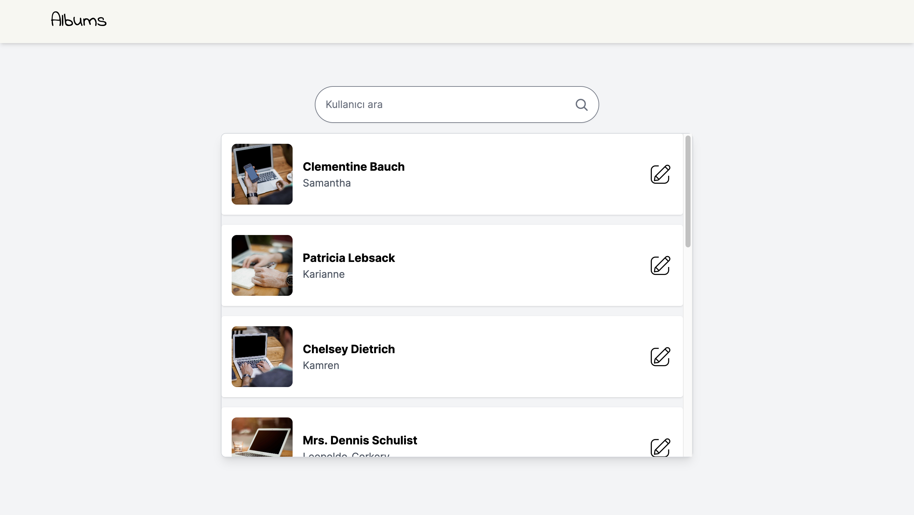
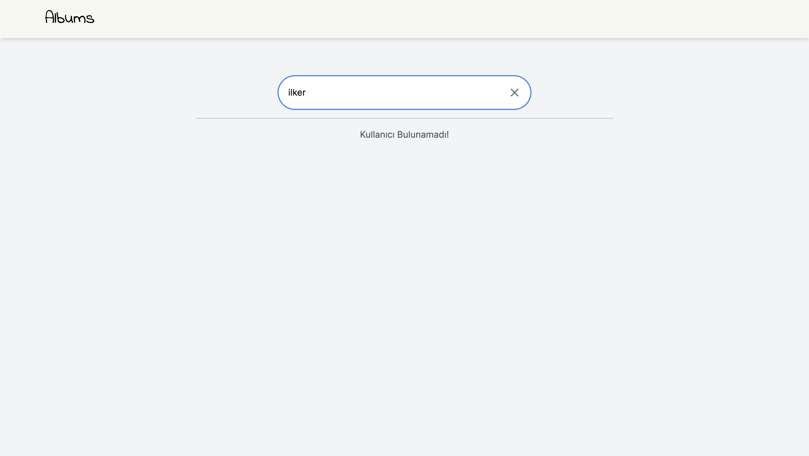
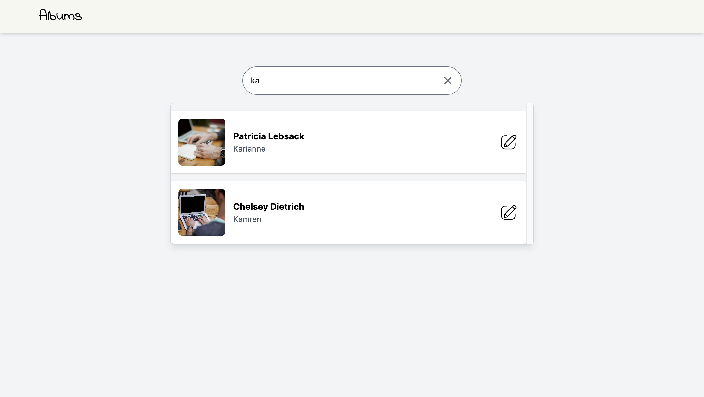
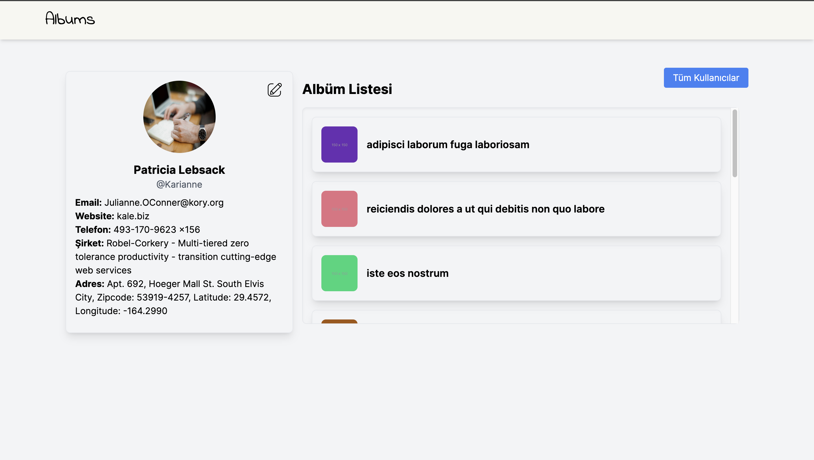
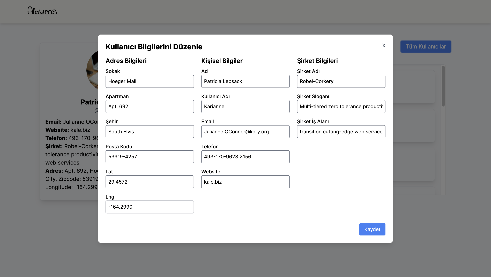
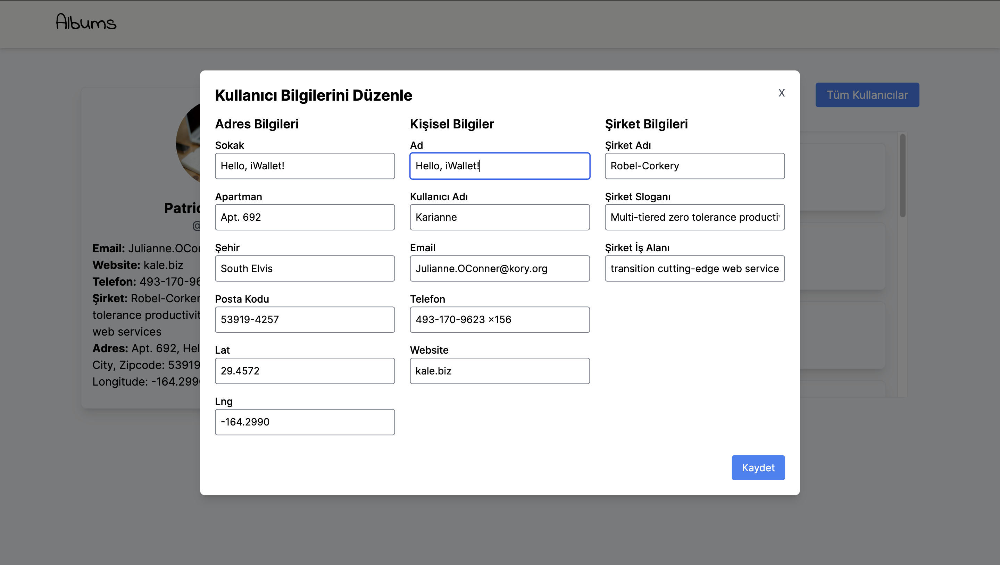
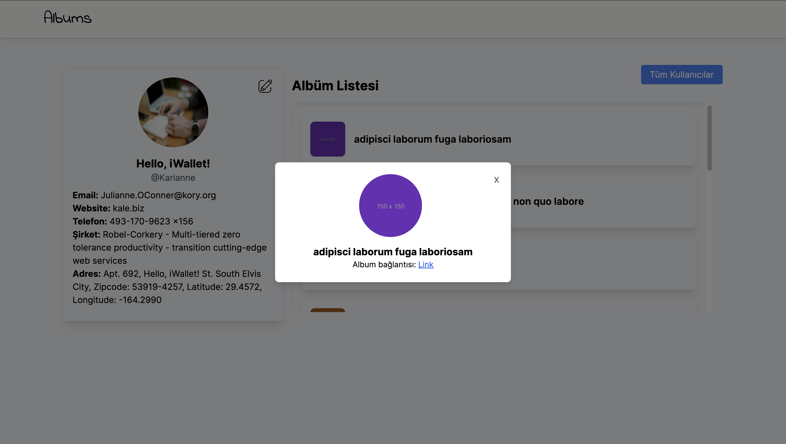

# README
This is a final project of the Iwallet Ruby on Rails Bootcamp. The project is a simple album managment web application.

## Requirements
- Ruby 3.3.0
- Rails 7.1.3.3
- PostgreSQL 14.11

## Installation and Setup
1. Clone the repository
```bash
git clone git@github.com:ilkertoklu/albums.git
```
2. Install dependencies
```bash
bundle install
```
3. Create and migrate the database
```bash
rails db:create db:migrate
```

4. Seed the database with source API
```bash
rails db:seed # This will fetch the data from the source API and save it to the database
```

5. Run the server
```bash
rails s
```

### Screenshots







